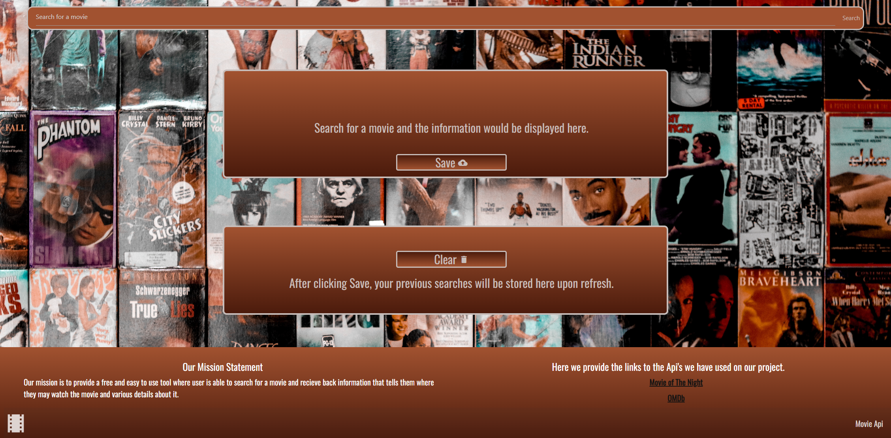

# Movie Tracker App 🍿
## Description

Welcome to the Movie Tracker App - your one-stop solution to find where your favorite movies are streaming along with memorable quotes from the film!

# Overview
As fellow film lovers, we designed this web application to allow users to search for a movie title and discover where it is currently streaming. In addition to streaming information, the app provides a quote from the movie to add a touch nostalgia and excitement. 

# Features

- *Search Functionality:* Easily find information about a movie by entering its title in the search bar.
- *Streaming Platforms:* Discover which platforms are currently streaming the movie you're interested in.
- *Movie Quotes:* Get a taste of the movie with a memorable Quote displayed alongside streaming details. 
- *Save Titles:* Save your favorite movie titles in a watch list for easy access. 

## Installation
This is an web application so there is no installation for users. You can search your favorite movie titles by simply accessing the platform in your browser at <a href="https://juniperwrenmcgill.github.io/The-Movie-Tracker/" target="_blank">https://juniperwrenmcgill.github.io/The-Movie-Tracker/</a>

## USAGE

## Credits
Huge shoutout to all collaberators who made this project possible! 

- Joseph Vanzandt: CSS and HTML
- Chad Andari: Head of JavaScript
- Juniper McGill: README, CSS, HTML, code maintainer, and Team Coordinator.

## License
- N/A